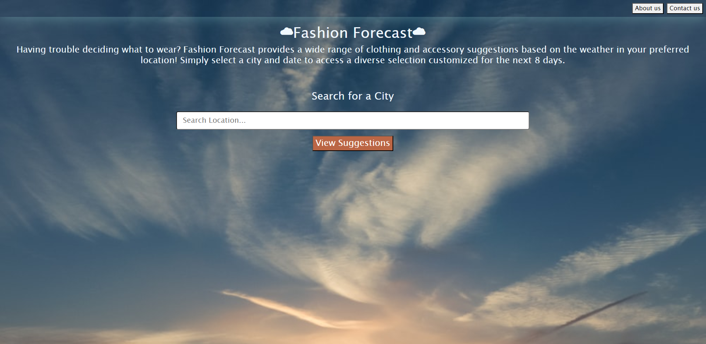
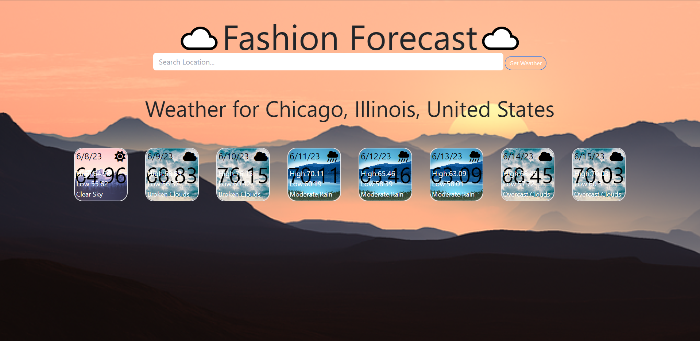
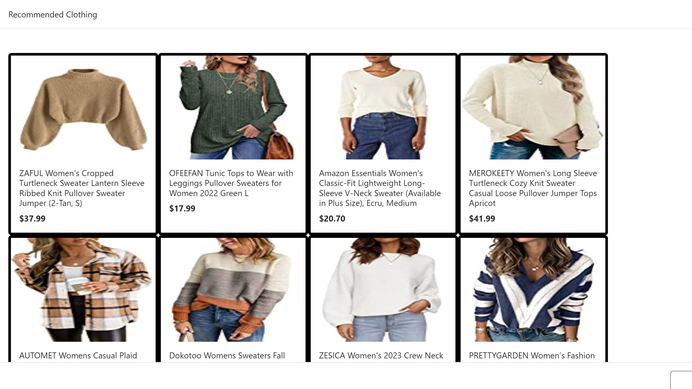

# FashionForecastProject

This is a Weather/Fashion API Project that me and a few of my class mates worked on together.


In this project, you will be able to use the application to find the weather, using the OpenWeatherMap API. In any location of world, using the MapBox API. Suggested clothing will then apear for the set forecast of the day/week, using the Amazon Price API. 

# Project Title 

Fashion Forecast


## User Story
```
    AS a Traveler,
    I WANT to know the weather at my destination.
    SO THAT I can pack accordingly.
    GIVEN when I type in the location I am seeking I then get the weather.
    SO when I look up the weather for the day/week I get clothing recommendations for displayed weather.
    WHEN I click on the recommended clothing, I am taken to the website where I as a Traveler can buy.

    As a user, I CAN see all of the results of provided clothes needed for the weather.
    As a user, I WANT to be able to save certain locations on the application.
    As a user, I WANT a quick view of the clothes when I press on the weather card.
    As a user, I CAN get the weather for the day/week.
```

## Visual 










## Technologies

HTML, Tailwind.css, Javascript, MapBox API, Amazon Price API, OpenWeatherMap API, jQuery


## Links

[GitHub Repo](https://github.com/Brian-Lascuna/fashion-forecast)


[Deployed Link](https://brian-lascuna.github.io/fashion-forecast/)


## Authors 

Brian Lascuna, Leslie Sanchez, Maryam Selassie, Kate Sundquist, Michael Welle


## License 

[MIT](https://choosealicense.com/licenses/mit/)